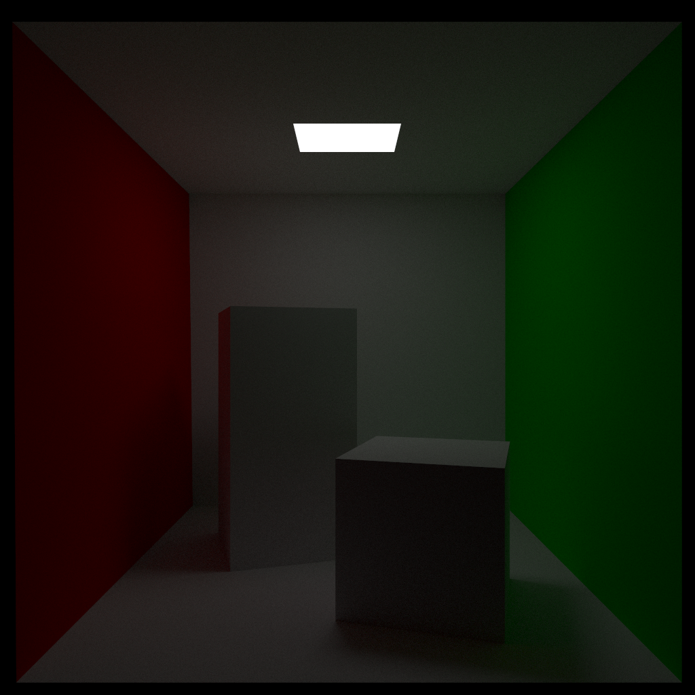
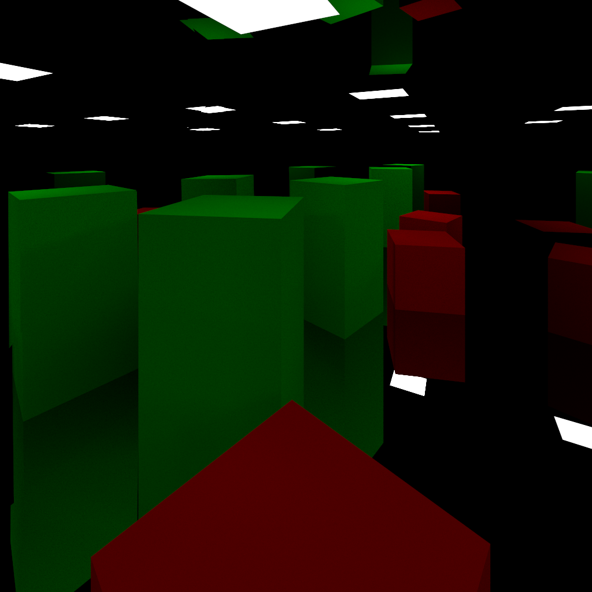
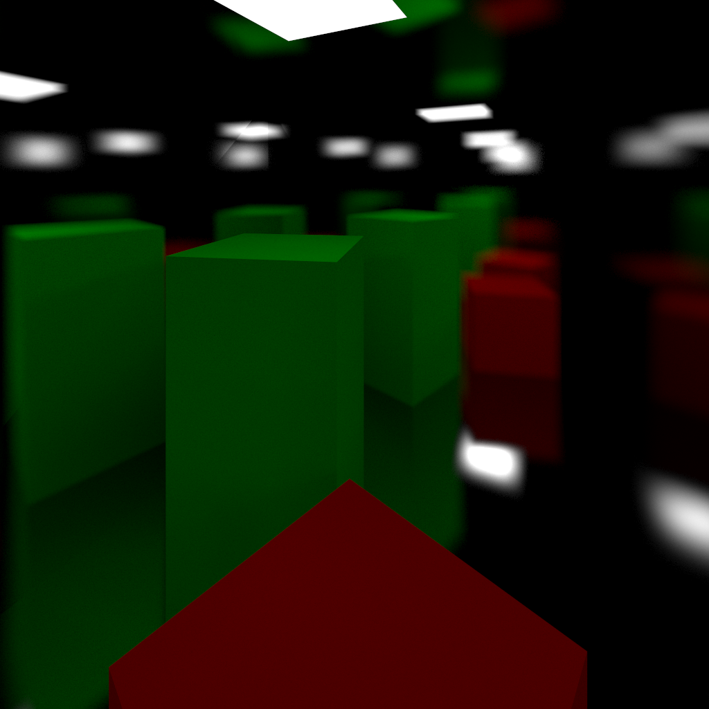
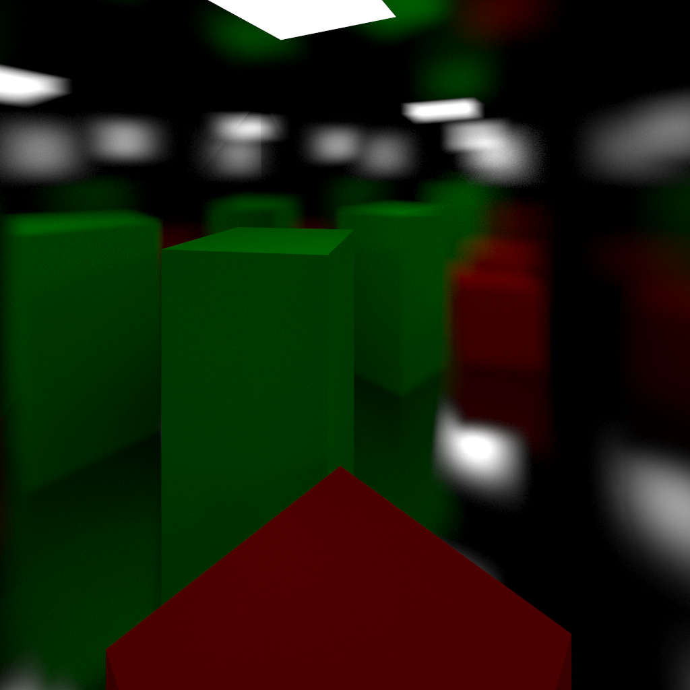
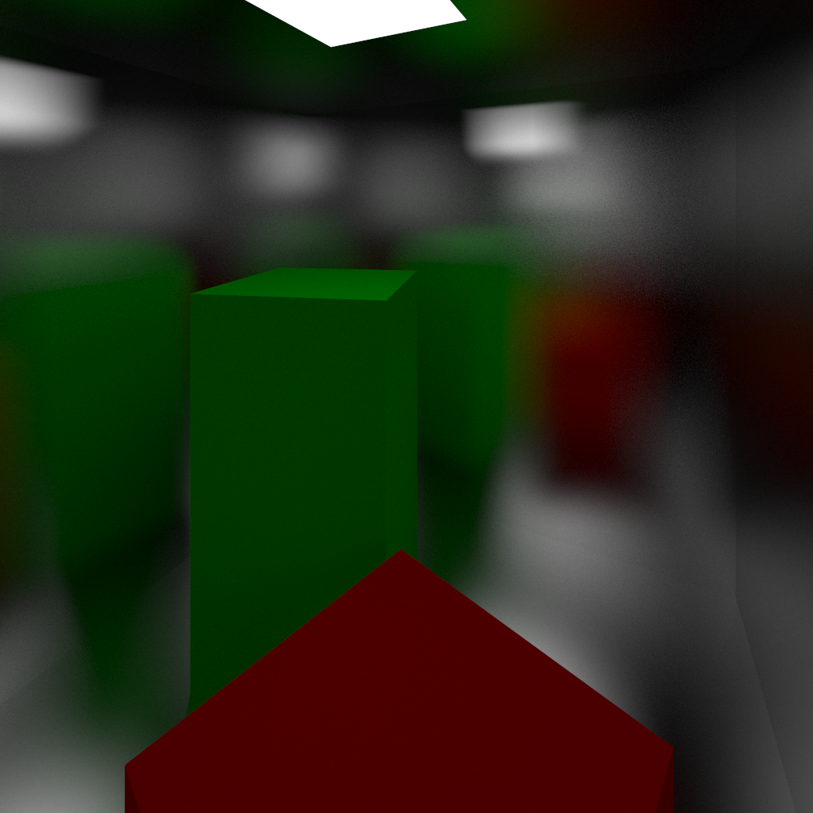
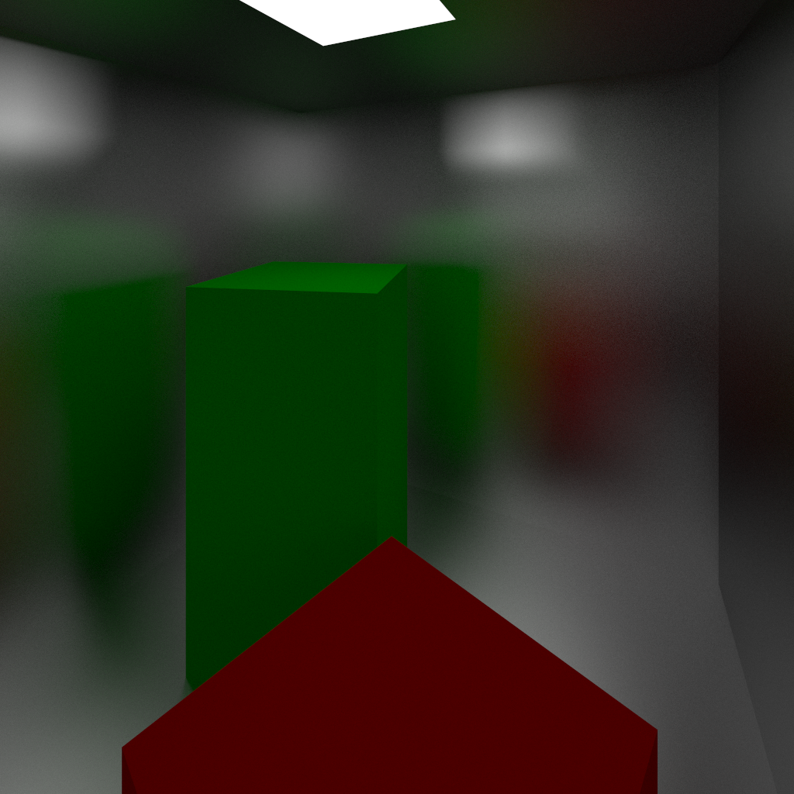
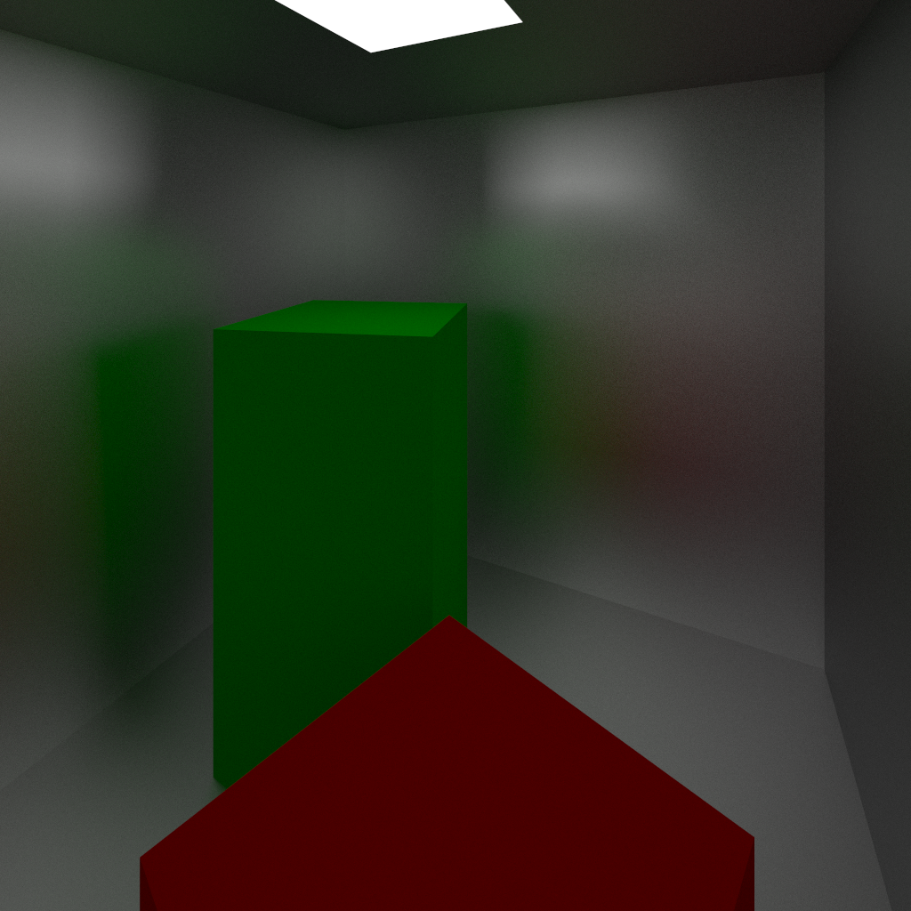

# Path Tracer

Implementation of the path tracing algorithm written in C++ and GLSL. Here are some of its features:

- Supports single threaded rendering on the CPU or concurrent rendering on the GPU using OpenGL.
  - GPU rendering is chunked into smaller jobs to avoid hogging the GPU from the OS.
- Positionable camera using a position/forward vector system.
- Proof of concept realtime rendering using SFML (only works on Linux).
- Logarithmic time ray-triangle intersections by using a bounding volume hierarchy (BVH) built with the surface area heuristic.
  - The BVH is implemented with neither recursion nor pointers to be compatible with GLSL. Rather, it uses a stack in place of recursion and an array to store nodes.
- Support for various materials:
  - Emitting/light materials of variable brightness and colour.
  - Lambertian diffuse or matte surfaces using random hemisphere sampling BRDF.
  - Specular diffuse or mirror surfaces of variable roughness using a combination of hemisphere and specular sampling BRDF's.
- Global illumination and soft shadows thanks to using path tracing instead of ray tracing.

## Examples

Standard Cornell Box.

- SPP (samples per pixel): 10,000.
- Ray depth: 5.
- Triangles in scene: 30.
- Resolution: 1024x1024.
- Completion time: 112 seconds on GPU (~50 billion rays).



Cornell box-esque scene with specular reflection walls of increasing roughness.

- SPP: 10,000.
- Ray depth: 5.
- Triangles in scene: 32.
- Resolution: 1024x1024.
- Average completion time: 230 seconds on GPU (~50 billion rays).








## Running

This project uses [Bazel](https://bazel.build/install) for building. To build any of the examples:

```bash
bazel build //examples:example-name
```

And to run the executable:

```bash
./bazel-bin/examples/example-name
```

## To Do

- explicit light sampling [here](https://computergraphics.stackexchange.com/questions/5152/progressive-path-tracing-with-explicit-light-sampling/5153#5153?newreg=ba3a51d61bf64da5a1b3a589287511b2)
  - punctual (point) light sources
  - light attenuation
- skybox
