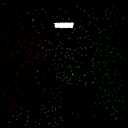
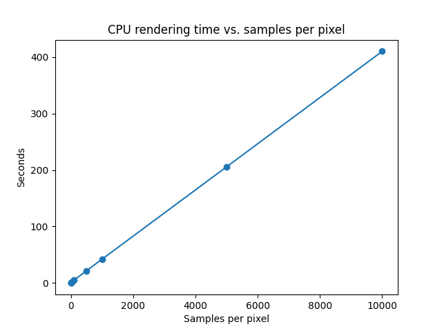

# Path Tracer

Path tracing algorithm implemented in C++ that supports rendering on the CPU and GPU using OpenGL. Uses BVH built with SAH as an acceleration structure.

## Examples

Cornell box rendered at 10,000 spp. Resolution: 1024x1024, time: 112 seconds (~50 billion rays).


## CPU vs GPU Rendering

CPU rendering runs on a single thread. GPU rendering is done in "chunks" of rectangles to split up the rendering task to smaller jobs as to not block the GPU. The speed increase from rendering on GPU can vary drastically depending on the scene and settings. Here are some benchmarks:

Benchmark system specs:

- CPU: Intel i5-12600K 4.9GHz
- GPU: AMD Radeon RX 6650XT

Cornell box on CPU:




## Building

This project uses [Bazel](https://bazel.build/install) for building. To build any of the examples:

```bash
bazel build //examples:example-name
```

And to run the executable:

```bash
./bazel-bin/examples/example-name
```

## To Do

- explicit light sampling [here](https://computergraphics.stackexchange.com/questions/5152/progressive-path-tracing-with-explicit-light-sampling/5153#5153?newreg=ba3a51d61bf64da5a1b3a589287511b2)
  - punctual (point) light sources
  - light attenuation
- skybox
