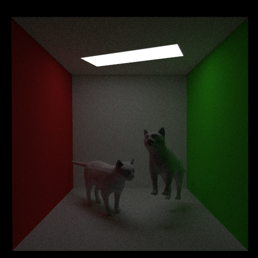

# Path Tracer

Path tracing algorithm implemented in C++ that supports the following:

- extendable object-oriented design
- look from/at camera model
- spheres
- triangles
- lambertian diffuse
- specular lighting
- emission and area lights
- global illumination
- soft shadows
- BVH acceleration
- CPU multithreaded rendering
- OBJ file loading

## Examples

Two cats in the Cornell box (~4200 triangles) rendered at 1000 spp:



## Building

This project uses [Bazel](https://bazel.build/install) for building. To build any of the examples:

```bash
bazel build //examples:example-name
```

And to run the executable:

```bash
./bazel-bin/examples/example-name
```

## To Do

- importance base sampling with BRDF instead of uniform and random
- explicit light sampling [here](https://computergraphics.stackexchange.com/questions/5152/progressive-path-tracing-with-explicit-light-sampling/5153#5153?newreg=ba3a51d61bf64da5a1b3a589287511b2)
  - punctual (point) light sources
  - light attenuation
- skybox

maybe:

- russian roulette
- python port
- GPU support with glsl
